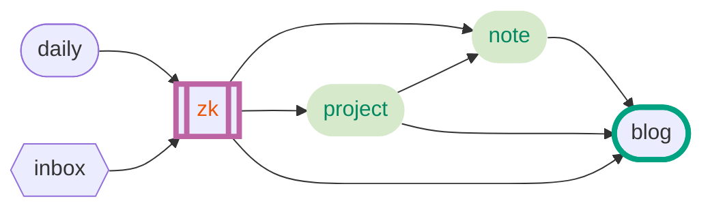
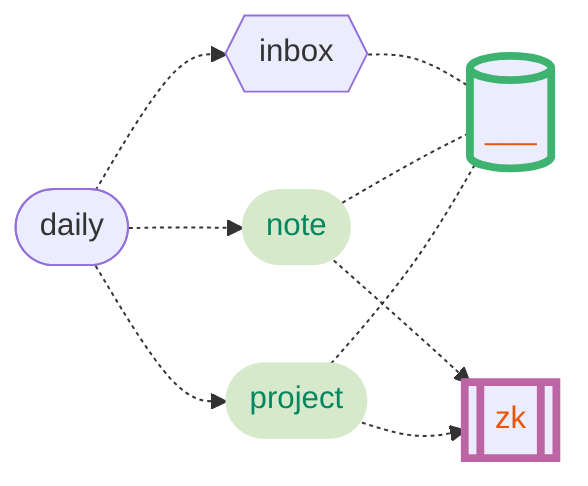

# obsidian 笔记流

学习了很久的笔记方法论，感觉自己终于搞懂了。故写此文，愿能帮助到和我以前一样迷茫的人，同时也希望抛砖引玉，有更好的方法能一起讨论。

## 我的笔记发展史

1. 使用**google keep**、**便签**等手机自带的工具。好处是非常便捷，坏处是不能称作笔记。[这篇文章有写到](https://www.yuque.com/deerain/gannbs/bzoyql)

2. 使用 markdown 写笔记，文件夹夹管理，自己写[博客](https://die4passion.github.io/notes/#/)，这篇文章也发表在那里。*迟早整理重构*。 (*流程后面会写到*)

3. 写博客解决了笔记汇总和输出的功能，但是当你有越来越多不同类型的记录和思考的时候，传统文件夹和笔记结构的劣势就出来了。**不管我分类如何好，始终会有很多冗余的信息**。很多时候不知道自己到底学了些什么想了一些什么。这些笔记之间到底有什么关系，仅仅是文件夹层级之间体现出来的关系吗，**世界是复杂的，笔记也是**。所以这些问题确实还是问题。

4. 因为关注[少数派](https://sspai.com/)。一走进去，就老有人说什么`卢曼笔记法`、`卡片笔记`、`双链`，我一般都会点进去认真读完文章，然后心里想的是什么鬼东西，就这？太形式主义了吧。但是我还是尝试了 `logseq` 、`notion`、`obsidian`等他们屡屡提及的生产力工具。

5. 拥抱新事物。因为官方文档和网上视频实在太过于晦涩难懂，**过分强调双链**等，安装卸载了无数次 `obsidian`。无数次不懈的摸索中，终于总结出了自己的方法。看了很多文章和视频，因为看懂了就没有收藏了，也就懒得去找了。

## 笔记 方法/流 之迷思

以下仅针对普通用户以及程序员，不包括科研及文献工作者。

我从去年年中知道了双链笔记，为什么到现在才正式使用呢。

我觉得有以下几点原因：

### 1. 非 `markdown` 语法

为什么要用 markdown 且必须是标准 markdown:

1. 类似数据交换大家都用 `json` 格式，markdown 也渐渐成为了文本编辑和写作的通用格式。
2. 不支持本地 markdown 不能保证我能用不同的编辑器查看和编辑。
3. markdown 语法对于我来说已经足够满足笔记的表达。
4. 纯文本格式非常方便数据转移、同步和备份等。

所以在我看来所有不是以 markdown 为核心的笔记软件通通排除。
比如 notion (完全不是)、 logseq (不是标准的) 等。

### 2. 过度宣传卡片笔记和双链等思想

双链到底有没有用？

几个月前你问我，答案肯定是否定的。
但是现在我终于搞明白到底是怎么回事了。
待我等会儿一一道来。

虽说双链有用，但是用处是有限的。
比如 [obsidian 官方中文文档](https://publish.obsidian.md/help-zh/%E7%94%B1%E6%AD%A4%E5%BC%80%E5%A7%8B)，这是网页版的，app 里面的内容基本一样。
这正是我要说的典型的为了双链而双链的写法。

这篇文档让我非常的晕，我相信不止我一个人看得很晕，虽然这种写法也一定有他的可取之处。相比较而言，同样是类似双链写法的维基百科，则从来不会看得很晕，所有的引用都做得很克制。

也正是这篇入门教程让曾经的我对 obsidian 以及相关的知识管理方法嗤之以鼻。因为我总是被教程劝退，自认为已经很努力在理解什么是双链、什么是知识管理、什么是卡片笔记等等等等。当然我肯定也在网上搜了很多教程，比如B站点击最高的[这篇](https://www.bilibili.com/video/BV18a411r7mt)

现在的我，对双链的观点是，肯定有用，但是不能滥用，得有自己的用法。每个人的用法不同，等一下我讲自己的用法。卡片笔记长青笔记等大家可以搜索了解一点，后面我讲的流程会借鉴一些。

### 3. 过度追求外观、主题等

网上和我加的群，经常会看到很多人秀自己的编辑器主题界面，自定义 `css/js` 等。
当然可以追求，毕竟美化能影响心情也是能提高生产力的，但沉迷这些就算本末倒置了。
很多这样的 obsidian 主题样式，前两天我在群里下了一个 [主题](https://github.com/cumany/Blue-topaz-examples)，可以说是本末倒置的杰出代表了。这也是我等下要讲的 all-in-one 的一种杰出代表。第一眼打开这个主题，说实话，我是很喜欢这个外观的，比我的黑色视觉上好看了很多。如果不是这和我的笔记方式不搭，很想很想换成这样。

### 4. 过度追求 `all-in-one`

首先，`all-in-one` 并不等于错误。仅仅是一种取舍。我更倾向于让工具做他最擅长的事情。
obsidian 和 vscode 最像，而不是其他笔记软件，仅仅从设计思路来看的话。两者都支持第三方插件，基于 electron。开放的生态让他们有了更多的可能性，也更需要好的使用者。我的观点是非必要，绝不增加使用新的插件。

过度的例子:

- 给 obsidian 加很多非 markdown 语法(比如 callout timeline)，搞很多渲染，搞得像以前很流行的富文本编辑器
- 用 obsidian 看 pdf，处理 word
- 还有很多只要你多用用多找找插件就明白我要说的是什么，同样推荐上面的[主题](https://github.com/cumany/Blue-topaz-examples)，你下载使用就知道我说的是什么(没有任何不尊重这个主题的意思，我说过很漂亮，但是不适合我)。不用多做，你挨着了解这个主题实现的功能就知道他加了多少对记录笔记知识管理非必要的东西。而很多人追求的正是这种。再次声明，没有对错。适合你的就是最好的。在此我只谈我的见解。

我的结论是，放弃过于臃肿的 all-in-one，使用正确的工具来做正确的事情。
`all-in-one = no-in-one`
比如知识管理我用 obsidian。写代码我用vscode，pycharm等。

## obsidian 设置

### 1. 基本设置先自己看

### 2. 主题配置

参照[这个B站视频](https://www.bilibili.com/video/BV1JU4y177cy)

hider 和 minimal 主题设置自己选择，不必和他一样

### 3. 我的设置

- `设置 -> 编辑器 -> 默认编辑模式 -> 源码模式` (相信我源码模式习惯了更好)
- 文件夹结构 (名字取自己顺眼的)
  - `___` 目录 ( moc )
  - `__u` 常用 (不常改动经常引用的) 和模板位置
  - `_inbox` 未经处理的思考
  - `daily` 日记
  - `note` 成型笔记 (卡片笔记法叫永久笔记之类的)
  - `project` 项目 (正在做的项目，比如工作，obsidian某个插件开发，python爬虫)
  - `zk` 零散的拼图 (哪里需要哪里拿)
- 核心插件除了以下全部打开
  - 视图状态
  - 星标
  - zk 卡片 (我认为是过时的方法)
  - 幻灯片
  - 录音机
  - 工作区 (可打开)
  - 发布
  - 同步
- 第三方插件安装 (无法fq就加官方q群下载，第二步有几个插件就不赘述)
  - calendar
  - collapse all (折叠/展开文件树,非必须)
  - floating toc (一个浮动的大纲,非必须)
  - todo pro (我自己写的哈哈) [日记增强插件 by Die4passion](https://forum-zh.obsidian.md/t/topic/6291)
    - 主要用来写日记的时候同步todo
- 常用快捷键
  - `ctrl + s` 保存文件
  - `ctrl + k` 插入链接
  - `ctrl + ,` 设置
  - `ctrl + alt + <-/->` 返回/前进
  - `ctrl + o` 打开文件
  - `ctrl + w` 关闭当前文件
  - `ctrl + p` 打开命令面板
  - `ctrl + e` 切换 预览/编辑 模式
  - `ctrl + enter` 切换待办状态
  - `ctrl + b` 选中文字粗体
  - `ctrl + i` 选中文字斜体
  - `ctrl + /` 注释
  - `ctrl + d` 删除当前行
  - `ctrl + n` 新建笔记

- 自定义快捷键
  - `ctrl + l` 插入模板
  - `alt + d` 打开/新建今天日记
  - `alt + a` 在文件在目录中位置
  - `ctrl + shit + ↑` 上移一行
  - `ctrl + shit + ↓` 下移一行
  - `alt + q` 显示/隐藏最左边的按钮栏 (需配合 hider)

至此，无需多余的设置，马上开始我们的笔记流程

## 我的笔记流

### 流程图

- inbox 放入 zk 之后即销毁
- blog 不做双链 直接成文
- blog 脱离 obsidian

### 关系图

- 下面几个文件夹之间只能有这些关联方式

### 例子

早上起来我写日记，用 todo-pro 自动同步todo列表到今天。

然后，我想起今天准备看一篇文章「Python与 R 在数据处理上的异同」。

我就在 `daily/YYYY-mm-dd.md/## todo` 下新建一个子标题 `### read` 写个 todo 列表。
todo 列表中加上这篇文章的链接。

晚上开始看了，觉得大有所获，于是新建 `_inbox/python-r-diff.md` 类似的。一边看一边记录整理。双链到 `daily` 中。

很多天之后，我终于看完了这篇文章，觉得很多地方其实写的不怎么样，然后我归纳整理并到 `zk/python-r-diff.md` 并删除 `_inbox` 中的记录，并且打上标签 `python, r`。

然后把 `daily` 中的这条 todo 状态改为已完成，这样他就不会同步到第二天了。

又过了数月，同样的流程，看了很多类似的文章，归纳整理之后我写了 `note/python-r-in-data.md`，双链到 `zk` 中的若干文件，或者直接删除搬到这里。

如此重复，学习了很多。然后新建 `___/python-r.md` 目录，链接到 `note/zk` 下的若干记录。

很多上面的步骤之后，双链和关系图谱对知识的梳理也就有了作用。

又过了很久，我终于悟了，想要发表一篇博客文章。
于是我从最近看的 python 和 r 相关的一系列笔记中提取信息，建立一个大纲，然后根据这个大纲修改修改，最终形成一篇完美的文章。棒！

再以 [docsify](https://docsify.js.org/)、[docusaurus](https://docusaurus.io/zh-CN/) 等方式搭建博客发表文章。文档结构和 obsidian 分离。

## 笔记同步

我使用的是git，搜索关键词 `obsidian git` 你就能找到了，不赘述。
官方同步听说不错，只是不舍得花钱哈哈。

## 关于 markdown

markdown 是非常简单好学的，推荐 [typora的文档](https://support.typora.io/zh/Markdown-Reference/), 建议在编辑中全部敲一遍。

我媳妇是物理老师，不到半个小时就教会了她，而且她还反过来教我使用 `latex` 语法, 我好像不怎么用得上那个 `ψ(._. )>`。她现在学 ps, 说用这个写笔记比word和其他笔记软件爽多了哈哈。(她用的本地编辑器 `marktext`)

## 补充资源

### bilibili视频

- [Obsidian笔记流分享 和 知识管理之浅见_哔哩哔哩_bilibili](https://www.bilibili.com/video/BV1ur4y1H713)
- [Obsidian笔记流分享 和 知识管理之浅见（二）_哔哩哔哩_bilibili](https://www.bilibili.com/video/BV1uZ4y1m7La)

### floating-toc-plugin

[改动版本打包下载](https://wwd.lanzouy.com/iUh0A03fibra)，解压到 `.obsidian/plugins` 目录下即可

!> 转载请注明作者 Die4passion

已发表到知乎: [如何使用Obsidian软件?](https://www.zhihu.com/question/401972085/answer/2435058005)

B站视频:

- [Obsidian笔记流分享 和 知识管理之浅见_哔哩哔哩_bilibili](https://www.bilibili.com/video/BV1ur4y1H713)
- [Obsidian笔记流分享 和 知识管理之浅见（二）_哔哩哔哩_bilibili](https://www.bilibili.com/video/BV1uZ4y1m7La)

> 和我讨论
>> q: 465335731 答案是 李白
